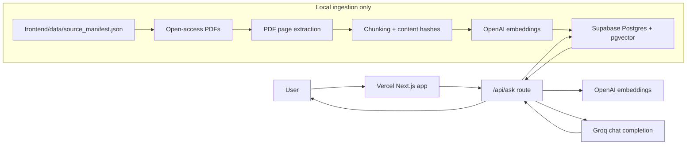

# AI/ML Knowledge RAG Assistant

A portfolio-ready AI/ML document assistant deployed as one Vercel Next.js app. The browser UI and `/api/ask` backend live together under `frontend/`; Supabase pgvector stores document chunks; OpenAI embeddings power retrieval; Groq generates grounded answers from retrieved context.

The production app no longer uses Render, FastAPI, FAISS, PyTorch, sentence-transformers, or local GPU/model loading. After ingestion, the app does not depend on your laptop being online.

## Architecture



## Tech Stack

- Next.js App Router
- Next.js Route Handlers
- Supabase PostgreSQL with pgvector
- OpenAI `text-embedding-3-small`
- Groq `llama-3.1-8b-instant`
- Local TypeScript ingestion script

## Repository Layout

```text
frontend/
  app/
    api/ask/route.ts
    page.tsx
    layout.tsx
    globals.css
  components/
  data/source_manifest.json
  scripts/ingest.ts
  supabase/schema.sql
  package.json
  .env.local.example
```

## Retrieval Settings

- `TOP_K=3`
- `SIMILARITY_THRESHOLD=0.6`
- `MAX_CONTEXT_CHARS=5000`
- `OPENAI_EMBEDDING_MODEL=text-embedding-3-small`

If no retrieved chunk has similarity `>= 0.6`, `/api/ask` returns:

```text
Not enough information in the indexed AI/ML documents to answer confidently.
```

## Supabase Setup

1. Create a Supabase project.
2. Open the Supabase SQL editor.
3. Run [frontend/supabase/schema.sql](frontend/supabase/schema.sql).
4. Confirm the `documents` table exists.
5. Confirm the `match_documents` function exists.

The schema enables pgvector, creates `documents`, adds a vector index, and defines:

```sql
match_documents(query_embedding vector(1536), match_threshold float, match_count int)
```

It returns `id`, `content`, `source_title`, `source_url`, `page_start`, `page_end`, `category`, and `similarity`.

## Local Environment

```powershell
cd frontend
Copy-Item .env.local.example .env.local
```

Fill in:

```text
SUPABASE_URL=
SUPABASE_SERVICE_ROLE_KEY=
EMBEDDING_PROVIDER=openai
OPENAI_API_KEY=
OPENAI_EMBEDDING_MODEL=text-embedding-3-small
GROQ_API_KEY=
GROQ_MODEL=llama-3.1-8b-instant
TOP_K=3
SIMILARITY_THRESHOLD=0.6
MAX_CONTEXT_CHARS=5000
```

Use the Supabase service role key only on the server or in local ingestion. Do not expose it as a `NEXT_PUBLIC_` variable.

## Install And Run

```powershell
cd frontend
npm install
npm run dev
```

Open `http://localhost:3000`.

## Ingest Documents

Run this after setting Supabase and OpenAI variables in `frontend/.env.local`:

```powershell
cd frontend
npm run ingest
```

The script reads [frontend/data/source_manifest.json](frontend/data/source_manifest.json), downloads legal/open-access PDFs into ignored local storage, extracts page text, chunks content, embeds chunks with OpenAI, skips existing `content_hash` rows, and uploads batches to Supabase.

The current manifest includes Stanford AI Index 2025, NIST AI RMF, NIST Generative AI Profile, OWASP LLM Top 10, Stanford CS229 notes, Attention Is All You Need, BERT, RAG surveys, LLM surveys, and agentic AI survey material.

## API Behavior

`POST /api/ask`

Request:

```json
{ "question": "What is overfitting?" }
```

Response:

```json
{
  "answer": "...",
  "citations": [],
  "retrieved_chunks": [],
  "similarity_scores": [],
  "refusal": false,
  "best_score": 0.82,
  "top_k": 3,
  "similarity_threshold": 0.6
}
```

The route embeds the question with OpenAI, calls Supabase `match_documents`, refuses unsupported questions, and sends only retrieved context to Groq.

## Vercel Deployment

Vercel settings:

- Root Directory: `frontend`
- Framework Preset: `Next.js`
- Install Command: `npm install`
- Build Command: `npm run build`
- Output Directory: leave blank/default

Environment variables:

```text
SUPABASE_URL=
SUPABASE_SERVICE_ROLE_KEY=
OPENAI_API_KEY=
OPENAI_EMBEDDING_MODEL=text-embedding-3-small
GROQ_API_KEY=
GROQ_MODEL=llama-3.1-8b-instant
TOP_K=3
SIMILARITY_THRESHOLD=0.6
MAX_CONTEXT_CHARS=5000
```

No Render backend is required. No local laptop, FAISS index, PyTorch model, or CUDA GPU is used at runtime.

## Testing

Build check:

```powershell
cd frontend
npm install
npm run build
```

Local API smoke test after ingestion:

```powershell
Invoke-RestMethod `
  -Uri http://localhost:3000/api/ask `
  -Method Post `
  -ContentType "application/json" `
  -Body '{"question":"What is overfitting?"}'
```

Verify:

- Supabase `match_documents` returns rows for AI/ML questions.
- `top_k` is `3`.
- `similarity_threshold` is `0.6`.
- Citations include source title, page number, and similarity score.
- Unsupported questions such as “Who won yesterday's NBA game?” return the refusal message.

## Future Improvements

- Add streaming answers from `/api/ask`.
- Add source/category filters.
- Add an admin-only reingestion dashboard.
- Add a reranker before Groq generation.
