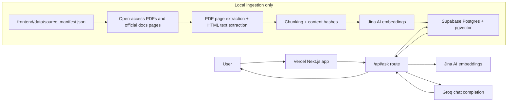

# AI/ML Knowledge RAG Assistant

A portfolio-ready AI/ML document assistant deployed as one Vercel Next.js app. The browser UI and `/api/ask` backend live together under `frontend/`; Supabase pgvector stores document chunks; Jina AI embeddings power retrieval; Groq generates grounded answers from retrieved context.

The production app no longer uses Render, FastAPI, FAISS, PyTorch, sentence-transformers, or local GPU/model loading. After ingestion, the app does not depend on your laptop being online.

## Architecture



## Tech Stack

- Next.js App Router
- Next.js Route Handlers
- Supabase PostgreSQL with pgvector
- Jina AI `jina-embeddings-v3`
- Groq `llama-3.1-8b-instant`
- Local TypeScript ingestion script

## Repository Layout

```text
frontend/
  app/
    api/ask/route.ts
    page.tsx
    layout.tsx
    globals.css
  components/
  data/source_manifest.json
  scripts/ingest.ts
  supabase/schema.sql
  package.json
  .env.local.example
```

## Retrieval Settings

- `TOP_K=3`
- `SIMILARITY_THRESHOLD=0.6`
- `MAX_CONTEXT_CHARS=3000`
- `GROQ_MAX_TOKENS=400`
- `CACHE_ENABLED=true`
- `EMBEDDING_PROVIDER=jina`
- `JINA_EMBEDDING_MODEL=jina-embeddings-v3`
- Jina v3 embeddings are stored as `vector(1024)`
- The API normalizes Jina cosine similarity into a `0` to `1` score before applying `SIMILARITY_THRESHOLD`.
- The API merges Supabase vector matches with a small exact lexical candidate set for foundation ML terms, then reranks candidates before returning `TOP_K=3`.
- The frontend intentionally hides `TOP_K`; the backend still retrieves three chunks by default.

If no retrieved chunk has similarity `>= 0.6`, `/api/ask` returns:

```text
Not enough information in the indexed AI/ML documents to answer confidently.
```

## Supabase Setup

1. Create a Supabase project.
2. Open the Supabase SQL editor.
3. Run [frontend/supabase/schema.sql](frontend/supabase/schema.sql).
4. Run [frontend/supabase/performance_cache.sql](frontend/supabase/performance_cache.sql).
5. Confirm the `documents`, `query_cache`, and `embedding_cache` tables exist.
6. Confirm the `match_documents` function exists.

The schema enables pgvector, creates `documents`, adds a vector index, and defines:

```sql
match_documents(query_embedding vector(1024), match_threshold float, match_count int)
```

It returns `id`, `content`, `source_title`, `source_url`, `page_start`, `page_end`, `category`, and `similarity`.

If you previously created the Supabase table with OpenAI's `vector(1536)` dimension, recreate the `documents` table before reingesting. For an empty old table, run [frontend/supabase/reset_jina_schema.sql](frontend/supabase/reset_jina_schema.sql) in the Supabase SQL editor. Existing OpenAI embeddings cannot be mixed with Jina `vector(1024)` embeddings.

If the schema changes in the future, run the reset SQL only when you are ready to delete and rebuild `public.documents`; then rerun ingestion from the manifest.

## Token and Latency Optimization

- `MAX_CONTEXT_CHARS=3000` limits the total retrieved context sent to Groq while preserving full citations in the API response.
- `GROQ_MAX_TOKENS=400` keeps generated answers concise; the prompt asks for 5-8 sentences unless the user requests more detail.
- `CACHE_ENABLED=true` enables Supabase-backed caching for repeated questions.
- `query_cache` stores normalized question hashes, final answers, citations, retrieved chunks, refusal status, and creation time.
- `embedding_cache` stores normalized question hashes and Jina `vector(1024)` embeddings so repeated normalized questions avoid another Jina call.
- `/api/ask` returns timing logs for embedding, retrieval, generation, and total request time.

Apply the cache tables by running [frontend/supabase/performance_cache.sql](frontend/supabase/performance_cache.sql) in the Supabase SQL editor. The first time a normalized question is asked, the route misses both caches, calls Jina, saves the embedding to `embedding_cache`, retrieves from Supabase, calls Groq, and saves the final answer to `query_cache`. Repeating the same normalized question returns from `query_cache` immediately with embedding, retrieval, and generation marked as skipped. If `query_cache` is bypassed or misses but `embedding_cache` contains the vector, the route skips Jina and still performs retrieval and generation.

To verify cache behavior locally, run the app and then:

```powershell
cd frontend
npm run test:cache
```

The second request for the same normalized question should return `cache_hit=true`.

## Frontend UX Improvements

- The Q&A surface uses improved spacing, responsive alignment, and clearer visual hierarchy.
- The header includes the grounded-source subtitle: Stanford CS229, Cornell CS4780, ISLR, ESL, scikit-learn docs, and modern AI/RAG research papers.
- A subtle LinkedIn feedback link points to [Shreevikas BJ](https://www.linkedin.com/in/shreevikasbj/).
- Answers include compact cache and response-time indicators.
- Timing details are available in a collapsible section and show query-cache hits, embedding-cache hits, and skipped retrieval/generation when applicable.
- Citations use scan-friendly source cards with clickable source titles, page labels, similarity scores, previews, and source links.
- The UI hides `top_k` while the backend keeps `TOP_K=3`.
- Loading and error states are more visible while keeping the interface lightweight.

## Knowledge Base Coverage

- ML Foundations: Stanford CS229, Cornell CS4780 notes, and A Course in Machine Learning cover supervised vs unsupervised learning, gradient descent, SVMs, feature engineering, overfitting, and core algorithms.
- Statistical Learning: ISLR with Python, ISLR Second Edition, and The Elements of Statistical Learning cover regression, classification, model selection, regularization, trees, boosting, PCA, and clustering.
- Tree Models and Boosting: Cornell CS4780 notes, ISLR/ESL, and scikit-learn docs cover decision trees, impurity, bagging, random forests, AdaBoost, gradient boosting, and boosting vs bagging.
- Regression and Classification: Stanford CS229, Cornell CS4780, ISLR/ESL, and scikit-learn cover linear regression, logistic regression, ridge, lasso, maximum likelihood, loss functions, and SVMs.
- Unsupervised Learning: Stanford CS229, Cornell CS4780, ISLR/ESL, and scikit-learn cover k-means, clustering, PCA, dimensionality reduction, and related preprocessing.
- Model Evaluation: scikit-learn, ISLR/ESL, and Cornell notes cover train/test splits, cross-validation, precision, recall, F1, ROC-AUC, confusion matrices, bias-variance, overfitting, and underfitting.
- Modern AI/LLMs/RAG: arXiv papers and surveys cover transformers, BERT/GPT/Llama, RAG, Graph RAG, LLM agents, responsible AI, AI safety, and governance.

## Local Environment

```powershell
cd frontend
Copy-Item .env.local.example .env.local
```

Fill in:

```text
SUPABASE_URL=
SUPABASE_SERVICE_ROLE_KEY=
EMBEDDING_PROVIDER=jina
JINA_API_KEY=
JINA_EMBEDDING_MODEL=jina-embeddings-v3
GROQ_API_KEY=
GROQ_MODEL=llama-3.1-8b-instant
TOP_K=3
SIMILARITY_THRESHOLD=0.6
CACHE_ENABLED=true
GROQ_MAX_TOKENS=400
MAX_CONTEXT_CHARS=3000
```

Use the Supabase service role key only on the server or in local ingestion. Do not expose it as a `NEXT_PUBLIC_` variable.

## Install And Run

```powershell
cd frontend
npm install
npm run dev
```

Open `http://localhost:3000`.

## Ingest Documents

Run this after setting Supabase and Jina variables in `frontend/.env.local`:

```powershell
cd frontend
npm run ingest
```

The script reads [frontend/data/source_manifest.json](frontend/data/source_manifest.json), downloads legal/open-access PDFs and official documentation pages into ignored local storage, extracts text, chunks content, embeds chunks with Jina AI, skips existing `content_hash` rows, retries failed embedding batches, waits between batches to respect Jina rate limits, and uploads batches to Supabase.

The current manifest includes Stanford CS229, Cornell CS4780 notes, ISLR, ESL, A Course in Machine Learning, scikit-learn user-guide sections, Stanford AI Index 2025, NIST AI RMF, NIST Generative AI Profile, OWASP LLM Top 10, Attention Is All You Need, BERT, RAG surveys, LLM surveys, and agentic AI survey material.

## API Behavior

`POST /api/ask`

Request:

```json
{ "question": "What is overfitting?" }
```

Response:

```json
{
  "answer": "...",
  "citations": [],
  "retrieved_chunks": [],
  "similarity_scores": [],
  "refusal": false,
  "best_score": 0.82,
  "top_k": 3,
  "similarity_threshold": 0.6,
  "cache_hit": false,
  "embedding_cache_hit": false,
  "timings": {
    "embedding_ms": 220,
    "retrieval_ms": 180,
    "generation_ms": 640,
    "total_ms": 1040
  }
}
```

On a query-cache hit, `cache_hit` is `true`, `embedding_cache_hit` is `"skipped"`, and embedding/retrieval/generation timings are `0`. The route normalizes and hashes the question, checks `query_cache`, embeds uncached questions with Jina AI, checks/saves `embedding_cache`, calls Supabase `match_documents`, merges in exact keyword candidates for foundation ML terms, refuses unsupported questions, and sends only trimmed retrieved context to Groq.

## Vercel Deployment

Vercel settings:

- Root Directory: `frontend`
- Framework Preset: `Next.js`
- Install Command: `npm install`
- Build Command: `npm run build`
- Output Directory: leave blank/default

Environment variables:

```text
SUPABASE_URL=
SUPABASE_SERVICE_ROLE_KEY=
EMBEDDING_PROVIDER=jina
JINA_API_KEY=
JINA_EMBEDDING_MODEL=jina-embeddings-v3
GROQ_API_KEY=
GROQ_MODEL=llama-3.1-8b-instant
TOP_K=3
SIMILARITY_THRESHOLD=0.6
CACHE_ENABLED=true
GROQ_MAX_TOKENS=400
MAX_CONTEXT_CHARS=3000
```

No Render backend is required. No local laptop, FAISS index, PyTorch model, or CUDA GPU is used at runtime.

## Testing

Build check:

```powershell
cd frontend
npm install
npm run build
```

Foundation ML verification after ingestion and while `npm run dev` is running:

```powershell
cd frontend
npm run test:foundation
```

Cache verification after running [frontend/supabase/performance_cache.sql](frontend/supabase/performance_cache.sql) and while `npm run dev` is running:

```powershell
cd frontend
npm run test:cache
```

The second request passes when it returns `cache_hit=true` or `embedding_cache_hit=true`, confirming repeated normalized questions do not call Jina again when a cache can satisfy the request.

Local API smoke test after ingestion:

```powershell
Invoke-RestMethod `
  -Uri http://localhost:3000/api/ask `
  -Method Post `
  -ContentType "application/json" `
  -Body '{"question":"What is overfitting?"}'
```

Verify:

- Supabase `match_documents` returns rows for AI/ML questions.
- `top_k` is `3`.
- `similarity_threshold` is `0.6`.
- Citations include source title, page number, and similarity score.
- Unsupported questions such as "Who won yesterday's NBA game?" return the refusal message.

## Future Improvements

- Add streaming answers from `/api/ask`.
- Add source/category filters.
- Add an admin-only reingestion dashboard.
- Add a reranker before Groq generation.
