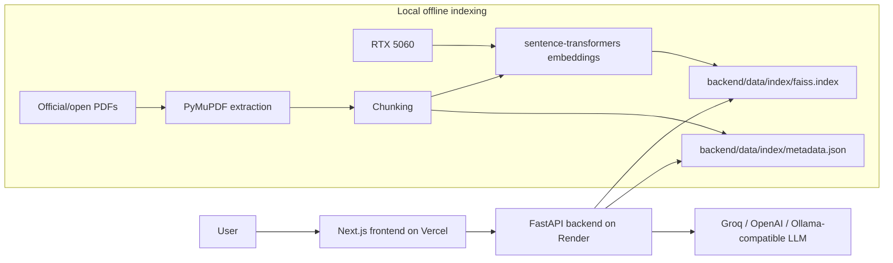

# AI/ML Knowledge RAG Assistant

A portfolio-ready AI and machine learning RAG system with a Vercel-hosted Next.js frontend, a Render-hosted FastAPI backend, local RTX 5060 embedding generation, FAISS vector search, strict retrieval grounding, and citation-based answers.

Streamlit was removed so the frontend can be deployed as a modern web app and the RAG service can run as a clean Python API.

## Production Architecture



The RTX 5060 is used only to download PDFs and build the FAISS artifacts locally. The deployed production app does not depend on the laptop being online.

## Tech Stack

- Frontend: Next.js App Router, React, Vercel
- Backend: FastAPI, Uvicorn, Render
- Retrieval: FAISS `IndexFlatIP`, normalized sentence-transformer embeddings
- Embeddings: `BAAI/bge-base-en-v1.5`
- Local indexing: PyTorch CUDA on RTX 5060 when available, CPU fallback otherwise
- Generation: Groq by default, with OpenAI and Ollama-compatible options

## Repository Layout

```text
frontend/
  app/
  components/
backend/
  main.py
  rag/
  scripts/
  data/
    raw_pdfs/      # PDFs ignored, rebuilt locally
    processed/     # extracted/chunked intermediates ignored
    index/         # committed deployable FAISS artifacts
docs/
render.yaml
requirements.txt
.env.example
```

## Retrieval Settings

- `TOP_K=3`
- `SIMILARITY_THRESHOLD=0.6`
- `EMBEDDING_MODEL=BAAI/bge-base-en-v1.5`
- `RAG_CHUNK_SIZE_TOKENS=1000`
- `RAG_CHUNK_OVERLAP_TOKENS=200`

The backend retrieves the top 3 chunks and answers only if at least one chunk has similarity `>= 0.6`. Otherwise it returns:

```text
Not enough information in the indexed AI/ML documents to answer confidently.
```

## Local Backend Setup

```powershell
python -m venv .venv
.\.venv\Scripts\Activate.ps1
pip install -r requirements.txt
Copy-Item .env.example .env
```

For local testing without a hosted LLM key, set:

```text
LLM_PROVIDER=none
```

For production-style generation, use:

```text
LLM_PROVIDER=groq
GROQ_API_KEY=<your key>
GROQ_MODEL=llama-3.1-8b-instant
```

## Build Index Locally With RTX 5060

```powershell
python backend/scripts/download_sources.py
python backend/scripts/build_index.py
```

This downloads the official/open-access PDFs from the source manifest, extracts page text, chunks documents, embeds locally with CUDA if available, normalizes vectors, and writes:

```text
backend/data/index/faiss.index
backend/data/index/metadata.json
backend/data/index/index_manifest.json
```

The current index artifacts are small enough for GitHub and are committed for the simple Render deployment path. Raw PDFs and processed intermediates stay ignored because they are larger and rebuildable.

If artifacts ever become too large for GitHub, upload them to external storage or a Render persistent disk and set:

```text
INDEX_ARTIFACT_URL=<download URL for faiss.index>
METADATA_ARTIFACT_URL=<download URL for metadata.json>
```

The backend will download missing artifacts at startup when those URLs are configured.

## Run Backend Locally

```powershell
uvicorn backend.main:app --reload --host 0.0.0.0 --port 8000
```

Endpoints:

- `GET /health`
- `GET /ready`
- `GET /sources`
- `POST /ask`

`/health` returns backend status, `index_loaded`, `total_chunks`, `embedding_model`, `top_k`, and `similarity_threshold`. `/ready` returns 200 only when the FAISS index and metadata are loadable.

## Render Backend Deployment

This repo includes [render.yaml](render.yaml) for a Render web service.

1. Push the repo to GitHub.
2. In Render, create a Blueprint or Web Service connected to this repo.
3. Use the included `render.yaml`, or configure manually:
   - Runtime: Python
   - Build command: `pip install -r requirements.txt`
   - Start command: `uvicorn backend.main:app --host 0.0.0.0 --port $PORT`
4. Add environment variables:
   - `LLM_PROVIDER=groq`
   - `GROQ_API_KEY=<your Groq key>`
   - `GROQ_MODEL=llama-3.1-8b-instant`
   - `EMBEDDING_MODEL=BAAI/bge-base-en-v1.5`
   - `TOP_K=3`
   - `SIMILARITY_THRESHOLD=0.6`
   - `ALLOWED_ORIGINS=https://your-vercel-app.vercel.app`
5. Deploy.
6. Test:
   - `https://your-render-backend.onrender.com/health`
   - `https://your-render-backend.onrender.com/ready`
   - `https://your-render-backend.onrender.com/sources`

Render runs question embeddings on CPU unless you choose a GPU-capable host. It does not need your local RTX 5060 or local laptop after the FAISS artifacts are deployed.

## Frontend Setup

```powershell
cd frontend
npm install
Copy-Item .env.local.example .env.local
npm run dev
```

`frontend/.env.local.example` contains:

```text
NEXT_PUBLIC_API_BASE_URL=http://localhost:8000
```

## Vercel Frontend Deployment

1. Import this GitHub repo in Vercel.
2. Set project root to `frontend`.
3. Add environment variable:
   - `NEXT_PUBLIC_API_BASE_URL=https://your-render-backend.onrender.com`
4. Deploy.
5. Test the full question-answer flow from the Vercel URL.

Do not hardcode localhost in production. The frontend reads the backend URL from `NEXT_PUBLIC_API_BASE_URL`.

## Tests

Backend checks:

```powershell
python -m compileall backend
python backend/scripts/test_retrieval.py
```

Production API smoke test:

```powershell
python backend/scripts/test_production_api.py --api-base-url https://your-render-backend.onrender.com
```

Frontend checks when npm is available:

```powershell
cd frontend
npm install
npm run build
```

## Source Manifest

The source list is documented in [docs/SOURCE_MANIFEST.md](docs/SOURCE_MANIFEST.md), and `backend/data/raw_pdfs/source_manifest.json` is generated by the downloader. The project uses official, legal, and open-access sources only.

## Example Questions

- What is overfitting?
- How does attention work in transformers?
- What does the NIST AI RMF say about measuring AI risk?
- What are common RAG failure modes?
- Who won yesterday's NBA game?

The NBA question should refuse because it is outside the indexed AI/ML documents.

## Troubleshooting

If `/ready` returns 503:

```text
FAISS index not found. Build the index locally and deploy/copy backend/data/index/faiss.index and metadata.json.
```

Rebuild locally and make sure `backend/data/index/faiss.index` and `backend/data/index/metadata.json` are present in the deployed backend.

If Groq generation fails, verify `LLM_PROVIDER=groq`, `GROQ_API_KEY`, and `GROQ_MODEL`.

If the frontend cannot reach the backend, check:

```text
NEXT_PUBLIC_API_BASE_URL=https://your-render-backend.onrender.com
ALLOWED_ORIGINS=https://your-vercel-app.vercel.app
```

## Future Improvements

- Add a reranker for stronger citation ordering.
- Add streamed answer generation.
- Add category/source filters.
- Add a managed artifact store for larger indexes.
- Add Docker images for backend deployment portability.
