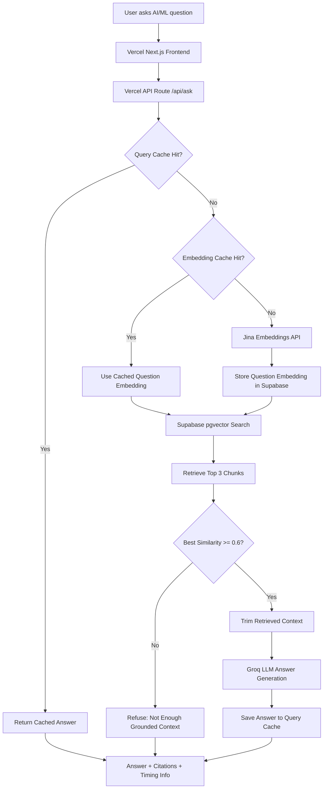

# AI/ML Knowledge RAG Assistant

A portfolio-ready AI/ML document assistant that answers questions from grounded, open-access machine learning and modern AI sources. The final V4 system runs as a single Vercel Next.js app: the browser UI and `/api/ask` route live together under `frontend/`, Supabase pgvector stores document chunks, Jina AI creates query embeddings, Groq generates grounded answers, and cache/timing metadata makes performance observable.

The production app does not use Render, FastAPI, FAISS, PyTorch, sentence-transformers, or local GPU/model loading at runtime. After ingestion, it does not depend on a local laptop being online.

## Architecture Evolution

This project evolved through four architecture versions. V1 to V3 were useful learning and deployment iterations; V4 is the final optimized production architecture.

### V1 - Streamlit + Local FAISS RAG

The initial version used Streamlit as the frontend. PDFs were processed locally, embeddings were stored in FAISS, and the Python RAG pipeline proved the core retrieval-augmented generation workflow.

This was good for local prototyping and validating RAG concepts, but it was not ideal for production deployment or Vercel hosting.

```text
User -> Streamlit UI -> Python RAG pipeline -> FAISS -> LLM answer
```

### V2 - Vercel Frontend + Render FastAPI Backend

V2 replaced Streamlit with a Next.js frontend deployed on Vercel and moved RAG logic into a FastAPI backend deployed on Render. It still used FAISS and a local/server-side embedding model.

This version looked more production-like because the frontend and backend were separated. It also validated the deployment split, but Render free-tier memory limits made the setup unreliable because FAISS, metadata, and the embedding model were too heavy for 512 MB RAM.

```text
Vercel Next.js frontend -> Render FastAPI backend -> FAISS + sentence-transformers -> Groq/OpenAI answer
```

### V3 - Lightweight Vercel + Supabase Architecture

V3 removed Render and FastAPI from the production path. Backend logic moved into Vercel API routes, FAISS was replaced with Supabase pgvector, the local embedding model was replaced with hosted Jina embeddings, and Groq handled final answer generation.

This solved the memory issue and made the system cloud-native, lightweight, and easier to deploy without a persistent Python backend.

```text
Vercel Next.js frontend + /api/ask -> Jina embeddings -> Supabase pgvector -> Groq answer
```

### V4 - Optimized RAG with Caching, Lower Token Usage, and Performance Tracking

V4 is the final production architecture. It keeps the lightweight Vercel + Supabase design from V3 and adds the optimization layer needed for a polished, portfolio-ready RAG app.

V4 adds:

- `query_cache` for instantly returning repeated answers.
- `embedding_cache` to avoid repeated Jina calls for repeated normalized questions.
- `MAX_CONTEXT_CHARS` to reduce the retrieved context sent to Groq.
- `GROQ_MAX_TOKENS` to control answer length and token usage.
- Concise answer mode for student-friendly 5-8 sentence responses by default.
- Timing logs: `embedding_ms`, `retrieval_ms`, `generation_ms`, and `total_ms`.
- Cache status: query-cache hit/miss and embedding-cache hit/miss/skipped.
- Cleaner frontend answer cards with clickable citations, similarity scores, timing details, and cache indicators.
- Expanded knowledge coverage across foundational ML and modern AI/LLM/RAG documents.

Final V4 architecture:

```text
User -> Vercel Next.js UI -> /api/ask -> query_cache check
If cache hit -> return cached answer
If cache miss -> embedding_cache check -> Jina embedding if needed -> Supabase pgvector retrieval -> trimmed context -> Groq answer -> save to cache -> response with citations/timings
```



| Version | Architecture | Why it changed |
| --- | --- | --- |
| V1 | Streamlit + FAISS local RAG | Good prototype, not production-friendly |
| V2 | Vercel frontend + Render FastAPI backend + FAISS | Better separation, but Render memory limits caused failures |
| V3 | Vercel API route + Supabase pgvector + Jina + Groq | Lightweight cloud-native architecture without Render |
| V4 | V3 + query cache + embedding cache + trimmed context + timing logs | Reduced latency, reduced token usage, better UX, production-ready |

## Why V4 Is the Final Optimized Architecture

- No Render dependency.
- No FAISS index loaded into server memory.
- No PyTorch or sentence-transformers running in production.
- Supabase stores vectors persistently with pgvector.
- Jina handles embeddings externally.
- Groq handles grounded answer generation.
- Query cache reduces repeated-question latency.
- Embedding cache reduces repeated embedding API calls.
- Trimmed context reduces Groq token usage.
- Timing logs make performance observable.
- Citations and similarity scores keep answers explainable.
- Unsupported questions are refused when similarity is below the threshold.

## Final Tech Stack

- Next.js App Router
- TypeScript
- Vercel
- Supabase PostgreSQL with pgvector
- Jina embeddings (`jina-embeddings-v3`)
- Groq LLM (`llama-3.1-8b-instant` by default)
- SQL migrations
- Retrieval-augmented generation
- Query and embedding caching
- Citation-based retrieval and answer display

## Token and Latency Optimization

Before V4, every question triggered the full path:

```text
Jina embedding -> Supabase retrieval -> Groq generation
```

After V4:

- Repeated same questions return directly from `query_cache`.
- Repeated normalized questions can reuse `embedding_cache`.
- Retrieved chunks are trimmed before being sent to Groq.
- Groq output length is controlled with `GROQ_MAX_TOKENS`.
- Timing logs show where latency is spent.

Key runtime settings:

- `CACHE_ENABLED=true`
- `MAX_CONTEXT_CHARS=3000`
- `GROQ_MAX_TOKENS=400`
- `TOP_K=3`
- `SIMILARITY_THRESHOLD=0.6`

## Performance and Observability

Every `/api/ask` response includes metadata for debugging and UX display:

- `cache_hit`
- `embedding_cache_hit`
- `embedding_ms`
- `retrieval_ms`
- `generation_ms`
- `total_ms`
- similarity scores for citations
- threshold-based refusal status

If `query_cache` hits, the API returns the cached answer immediately and reports embedding, retrieval, and generation as skipped. If `query_cache` misses but `embedding_cache` hits, the API avoids another Jina call and continues to Supabase retrieval and Groq generation.

## Knowledge Base Coverage

The assistant is grounded in official/open-access sources including:

- Stanford CS229 Machine Learning Notes
- Cornell CS4780 Machine Learning Notes
- ISLR with Python
- ISLR Second Edition
- The Elements of Statistical Learning
- A Course in Machine Learning
- scikit-learn documentation
- RAG, LLM, AI agent, and modern AI survey papers

Covered topics include:

- linear regression
- logistic regression
- ridge and lasso regression
- decision trees
- random forests
- gradient boosting
- SVM
- k-means
- PCA
- cross-validation
- bias-variance tradeoff
- precision, recall, and F1
- overfitting
- RAG and LLM concepts

## Repository Layout

```text
frontend/
  app/
    api/ask/route.ts
    page.tsx
    layout.tsx
    globals.css
  components/
    AskBox.tsx
    AnswerCard.tsx
    SourcesList.tsx
  data/source_manifest.json
  scripts/
    ingest.ts
    test_cache.ts
    test_foundation_questions.ts
  supabase/
    schema.sql
    performance_cache.sql
    reset_jina_schema.sql
  package.json
  .env.local.example
  .env.production.example
```

## Supabase Setup

1. Create a Supabase project.
2. Open the Supabase SQL editor.
3. Run [frontend/supabase/schema.sql](frontend/supabase/schema.sql).
4. Run [frontend/supabase/performance_cache.sql](frontend/supabase/performance_cache.sql).
5. Confirm the `documents`, `query_cache`, and `embedding_cache` tables exist.
6. Confirm the `match_documents` function exists.

The schema enables pgvector, creates `documents`, adds a vector index, and defines:

```sql
match_documents(query_embedding vector(1024), match_threshold float, match_count int)
```

It returns `id`, `content`, `source_title`, `source_url`, `page_start`, `page_end`, `category`, and `similarity`.

If you previously created the Supabase table with OpenAI's `vector(1536)` dimension, recreate the `documents` table before reingesting. For an empty old table, run [frontend/supabase/reset_jina_schema.sql](frontend/supabase/reset_jina_schema.sql) in the Supabase SQL editor. Existing OpenAI embeddings cannot be mixed with Jina `vector(1024)` embeddings.

## Local Environment

```powershell
cd frontend
Copy-Item .env.local.example .env.local
```

Fill in placeholders only:

```text
SUPABASE_URL=
SUPABASE_SERVICE_ROLE_KEY=
EMBEDDING_PROVIDER=jina
JINA_API_KEY=
JINA_EMBEDDING_MODEL=jina-embeddings-v3
GROQ_API_KEY=
GROQ_MODEL=llama-3.1-8b-instant
TOP_K=3
SIMILARITY_THRESHOLD=0.6
CACHE_ENABLED=true
GROQ_MAX_TOKENS=400
MAX_CONTEXT_CHARS=3000
```

Use the Supabase service role key only on the server or in local ingestion. Do not expose it as a `NEXT_PUBLIC_` variable.

## Install and Run Locally

```powershell
cd frontend
npm install
npm run dev
```

Open `http://localhost:3000`.

## Ingest Documents

Run this after setting Supabase and Jina variables in `frontend/.env.local`:

```powershell
cd frontend
npm run ingest
```

The ingestion script reads [frontend/data/source_manifest.json](frontend/data/source_manifest.json), downloads legal/open-access PDFs and official documentation pages into ignored local storage, extracts text, chunks content, embeds chunks with Jina AI, skips existing `content_hash` rows, retries failed embedding batches, waits between batches to respect rate limits, and uploads batches to Supabase.

## API Behavior

`POST /api/ask`

Request:

```json
{ "question": "What is overfitting?" }
```

Response shape:

```json
{
  "answer": "...",
  "citations": [],
  "retrieved_chunks": [],
  "similarity_scores": [],
  "refusal": false,
  "best_score": 0.82,
  "top_k": 3,
  "similarity_threshold": 0.6,
  "cache_hit": false,
  "embedding_cache_hit": false,
  "timings": {
    "embedding_ms": 220,
    "retrieval_ms": 180,
    "generation_ms": 640,
    "total_ms": 1040
  }
}
```

On a query-cache hit, `cache_hit` is `true`, `embedding_cache_hit` is `"skipped"`, and embedding/retrieval/generation timings are `0`.

If no retrieved chunk has similarity `>= 0.6`, `/api/ask` refuses with:

```text
Not enough information in the indexed AI/ML documents to answer confidently.
```

## Frontend UX

- Clean Vercel-hosted Next.js UI.
- Grounded-source subtitle under the main title.
- Subtle LinkedIn feedback link.
- Question input with loading and error states.
- Answer cards with cache and timing badges.
- Clickable source titles and source links.
- Page labels and similarity scores for citations.
- Collapsible timing details.
- `TOP_K` stays in backend logic but is hidden from the visible UI.

## Vercel Deployment

Production uses Vercel only for the frontend and API route. Render/FastAPI was part of the legacy V2 architecture and is not used in the current production deployment.

Vercel settings:

- Root Directory: `frontend`
- Framework Preset: `Next.js`
- Install Command: `npm install`
- Build Command: `npm run build`
- Output Directory: leave blank/default

Environment variables:

```text
SUPABASE_URL=
SUPABASE_SERVICE_ROLE_KEY=
EMBEDDING_PROVIDER=jina
JINA_API_KEY=
JINA_EMBEDDING_MODEL=jina-embeddings-v3
GROQ_API_KEY=
GROQ_MODEL=llama-3.1-8b-instant
TOP_K=3
SIMILARITY_THRESHOLD=0.6
CACHE_ENABLED=true
GROQ_MAX_TOKENS=400
MAX_CONTEXT_CHARS=3000
```

No Render backend, FAISS index, PyTorch model, sentence-transformers runtime, CUDA GPU, or local laptop is required in production.

## Testing

Build check:

```powershell
cd frontend
npm install
npm run build
```

Foundation ML verification after ingestion and while `npm run dev` is running:

```powershell
cd frontend
npm run test:foundation
```

Cache verification after running [frontend/supabase/performance_cache.sql](frontend/supabase/performance_cache.sql) and while `npm run dev` is running:

```powershell
cd frontend
npm run test:cache
```

The second cache-test request passes when it returns `cache_hit=true` or `embedding_cache_hit=true`, confirming repeated normalized questions do not call Jina again when a cache can satisfy the request.

Local API smoke test after ingestion:

```powershell
Invoke-RestMethod `
  -Uri http://localhost:3000/api/ask `
  -Method Post `
  -ContentType "application/json" `
  -Body '{"question":"What is overfitting?"}'
```

## Future Improvements

- Add streaming answers from `/api/ask`.
- Add source/category filters.
- Add an admin-only reingestion dashboard.
- Add reranking before Groq generation.
