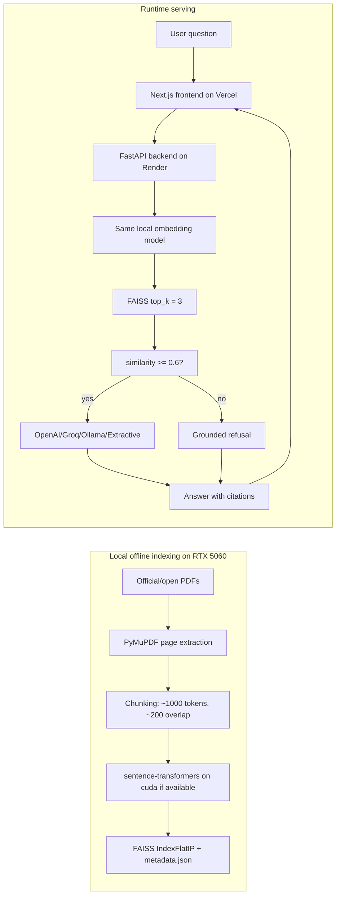

# Architecture

## Runtime Boundary

Vercel hosts only the `frontend/` Next.js application. Render hosts the FastAPI backend. Vercel and Render do not run local GPU embedding jobs and should not be expected to access an RTX 5060.

The RTX 5060 is used locally during offline indexing:

1. Download official/open-access PDFs into `backend/data/raw_pdfs/`.
2. Extract page text into `backend/data/processed/pages.jsonl`.
3. Chunk text into `backend/data/processed/chunks.jsonl`.
4. Embed chunks locally with sentence-transformers and PyTorch CUDA when available.
5. Store normalized vectors in `backend/data/index/faiss.index`.
6. Store citation metadata in `backend/data/index/metadata.json`.

At runtime, the Render-hosted FastAPI backend loads the FAISS artifact and metadata only when `/ask` is called, embeds the user question with the same sentence-transformers model on CPU, retrieves the top 3 chunks, applies the confidence gate, and calls the configured answer generator only when retrieval passes. The default production embedding model is `sentence-transformers/all-MiniLM-L6-v2` to fit lower-memory hosts.

## Diagram

## Retrieval Contract

- `TOP_K = 3`
- `SIMILARITY_THRESHOLD = 0.6`
- `CHUNK_SIZE_TOKENS = 1000`
- `CHUNK_OVERLAP_TOKENS = 200`
- Embeddings are normalized before FAISS storage.
- FAISS uses `IndexFlatIP`, which behaves like cosine similarity for normalized vectors.
- Answers are generated only if at least one retrieved chunk meets the threshold.
- Low-confidence questions return: `Not enough information in the indexed AI/ML documents to answer confidently.`

## Deployment Options

- Frontend: Vercel, with `NEXT_PUBLIC_API_BASE_URL` pointing to Render.
- Backend: Render web service using `render.yaml`, or another Python host that can install FAISS and run the embedding model.
- Index artifacts: rebuild locally, then copy `backend/data/index/faiss.index` and `backend/data/index/metadata.json` to the backend host.
- Artifact fallback: set `INDEX_ARTIFACT_URL` and `METADATA_ARTIFACT_URL` if the index is too large to commit.
